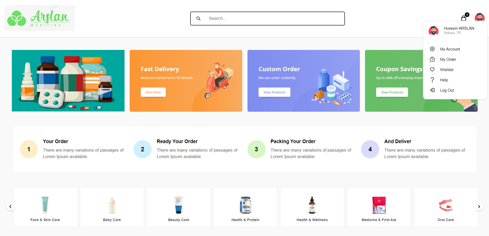
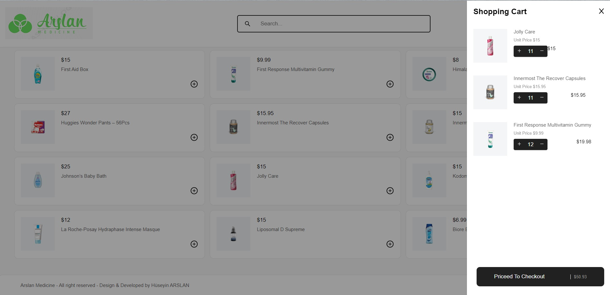

# Eczane Tabanlı E-Ticaret Sitesi
Bu çalışmamda React'ı kullanarak elektronik bir eczane şablonu tasarladım.
Redux state management kütüphanesini projeme entegre ederek prop drilling sorununu çözüp state yönetimini kolaylaştırdım; böylece uygulamayı ağırlaştıran ve karmaşık olmasına sebebiyet veren
component hiyerarşisini ortadan kaldırıp uygulamayı daha esnek 
ve verimli hâle getirdim.

